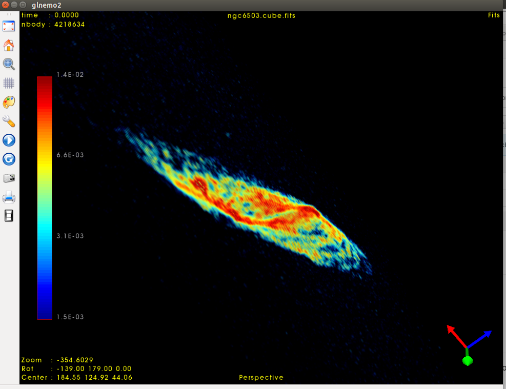

# SLICA
Spectral Line Image Cubes in Astronomy

A set of example and tutorials to work with spectral line image cubes, using python and python notebooks.

## Single Spectrum
An example of a single spectrum, from an ASCII table. Just reading and plot it, not much else going on. There is also a FITS version of the same table. Data are courtesy Roger Wesson.

## NGC 6503 Case 1
Using only astropy to read a **FITS** image cube, we grab a copy of the image cube into a numpy array, we analyze this cube using standard numpy and scipy modules, and use matplotlib. This is a simple approach, but we just work in pixel (or  voxel) space and ignore any astronomical coordinate systems for example. Data are courtesy Eric Greisen, NRAO.

## NGC 6503 Case 2
Using both astropy and some related modules that know about astronomical coordinates and a module that knows about data cubes, we repeat the previous case of NGC 6503 in this new framework.

## Orbits
An example how to set up a particle disk and observe a PV diagram or a velocity field.
